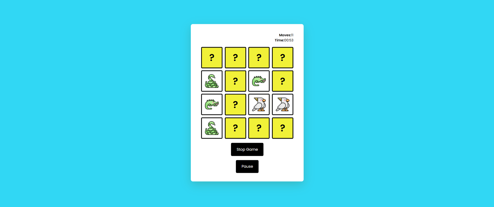
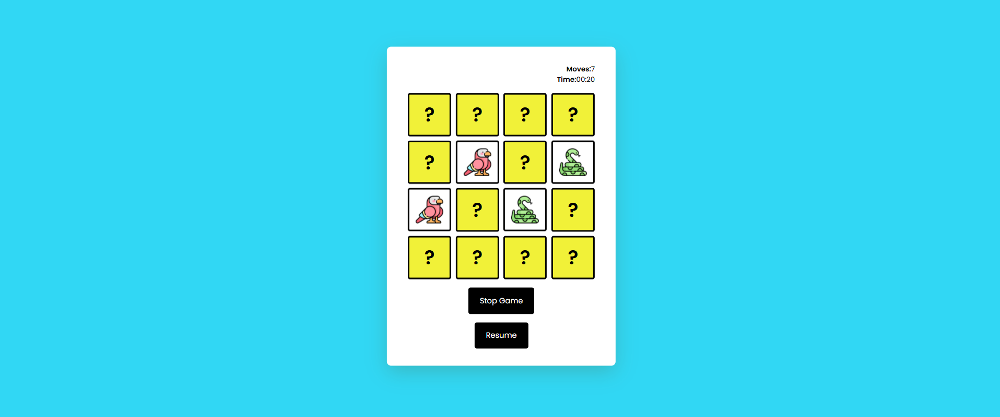
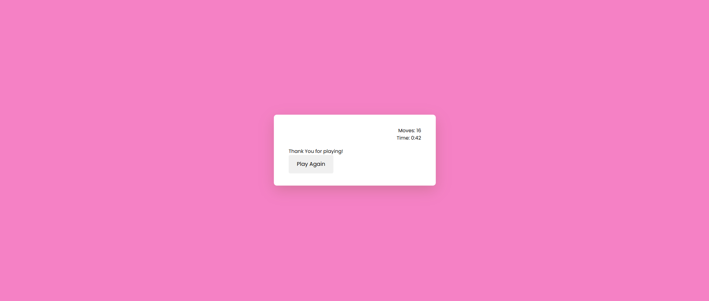

# Test Your Brain

Test Your Brain is an engaging memory matching game designed to challenge and sharpen your cognitive skills. Players must match pairs of cards, testing their memory, concentration, and speed. The game tracks the number of moves and time elapsed, allowing you to measure your brain power as you progress. With options to start, pause, and stop the game, it's perfect for quick mental workouts or longer challenges.

## Features
- **Start Game**: Initializes the game, resets the moves and timer, and displays the game grid.
- **Pause**: Pauses the timer and interaction with the game. Press it again to resume.
- **Stop Game**: Ends the game and redirects to a result page showing the number of moves and time.
- Tracks the **number of moves** and **time taken** to complete the game.
- **Win Condition**: The game is won when all card pairs are matched.
- **Responsive Design**: The game layout adjusts based on screen size for both desktop and mobile devices.

## Game Controls
- **Start Game**: Begins a new game session.
- **Pause**: Pauses the game. Press it again to resume.
- **Stop Game**: Stops the game and redirects to the result page, showing the number of moves and time.
- **Play Again**: Available on the result page, clicking this will restart the game.

## How to Play
1. Click the **Start Game** button to begin the game.
2. Click on two cards to flip them and try to match the pairs.
3. The game keeps track of the number of moves and the elapsed time.
4. When all pairs are matched, the game ends, and your moves and time are displayed on the result page.
5. You can pause or stop the game at any time. When you stop the game, the result page will appear, and you can click **Play Again** to restart.

## Screenshots

### Start Screen

*The screen where you can start the game by clicking "Start Game."*

### Playing Screen

*The active game board where you flip cards to match pairs.*

### Paused Screen

*This screen appears when the game is paused. You can resume or stop the game.*

### Stop Screen (Result Page)

*This is the screen when the game is stopped and the result is displayed with the number of moves and time. You can click "Play Again" to restart the game.*

## Technologies Used
- **HTML**: The structure of the game page.
- **CSS**: Styling and layout of the game.
- **JavaScript**: Game logic, timer, move counter, and user interactions.
- **LocalStorage**: Used to store the number of moves and time across page reloads.
- **Responsive Design**: Ensures the game is playable on various screen sizes, from mobile devices to desktops.

## Files
- `index.html`: The main HTML file that contains the structure and layout of the game.
- `result.html`: The page displayed after the game ends showing the result and "Play Again" button.
- `style.css`: The CSS file for styling the game.
- `script.js`: JavaScript file that contains the logic for the game.

## How to Play Again
After finishing the game, the result page will display the number of moves and the time taken. You can click the **Play Again** button to restart the game and try to improve your score.

## Contributing
1. Fork this repository.
2. Create a new branch for your feature or bug fix.
3. Commit your changes.
4. Push to your forked repository.
5. Open a pull request.

## Contact
If you have any questions or feedback, feel free to open an issue or reach out to me directly.

---

## Additional Notes
- You can customize the card deck by adding your own set of images or themes.
- Feel free to add animations or other features like sound effects to enhance the game experience.
- For advanced users, consider adding an AI opponent or multiplayer functionality.

---

Enjoy the game! 🎮
